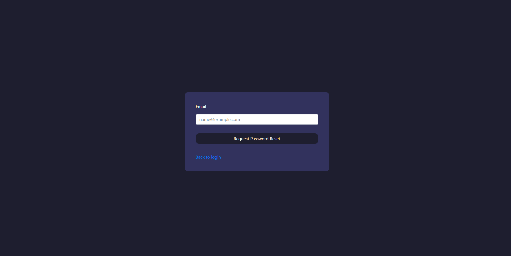

# DoStuff Task manager


> Simple web application that provides possibility of adding task to specific
> project made by user.


## Table of Contents
* [General Info](#general-information)
* [Technologies Used](#technologies-used)
* [Features](#features)
* [Screenshots](#screenshots)
* [Setup](#setup)
* [Usage](#usage)
* [Deployment](#deployment)
* [Project Status](#project-status)
* [Room for Improvement](#room-for-improvement)
* [License](#license)


## General Information
Application made mainly from learning Flask backend reasons


## Technologies Used
- Python 3.9.2
- HTML 5
- CSS
- Bootstrap 4
- Flask (Flask-login, Flask-migrate, Flask-bcrypt, Flask-mail)
- SQL ORM (Flask-SQLAlchemy)
- JavaScript


## Features
List the ready features here:
- Register of User in database
- Change of user account properties (picture included)
- Creation of new project and edition of their names
- Creation of new task with content to specific chosen user projects
- Mail support (sending mail with reset token), with asynchronous mail sending


## Screenshots





## Setup
```shell
# Get the code
git clone https://github.com/cryoMike90s/DoStuff.git
cd DoStuff

# Virtual modules installation (Windows based Systems)
virtualenv env
.\env\Scripts\activate

# Install modules
pip3 install -r requirements.txt

# Run the application
dostuff

```


## Usage
Mail support is now set for specific smtp server (Yahoo) and some problems would 
appear if any other would be connected without changing configuration inside
'DoStuff.config.py'

```python
import os
basedir = os.path.abspath(os.path.dirname(__file__))


class Config:
    SECRET_KEY = '36efc808e2e7127d66370ba4548af728'
    SQLALCHEMY_DATABASE_URI = "sqlite:///" + os.path.join(basedir, 'dostuff.db')
    SQLALCHEMY_TRACK_MODIFICATIONS = False
    MAIL_SERVER = 'smtp.mail.yahoo.com'
    MAIL_PORT = 587
    MAIL_USE_SSL = False
    MAIL_USE_TLS = True
    MAIL_USERNAME = os.environ.get('EMAIL_USER')
    MAIL_PASSWORD = os.environ.get('EMAIL_PASS_Y')
```
To make possible to use that mail support there is need to set environmental
variables in Your system or just directly change the value of two last line in
file mention above

##Deployment

### Docker Execution
```shell
# Get the code
git clone https://github.com/cryoMike90s/DoStuff.git
cd DoStuff

# Install an image on your docker (You can change name and tag)
docker run --name dostuff2 -d -p 8000:5000 dostuffer:latest

# Run container (Remember to use correct tag quoted during image creation
docker build -t dostuffer:latest .

```


## Project Status
Project is: _in progress_ 


## Room for Improvement
To do:
- Enable Full-Text Search Engine
- Deployment on Docker Container: DONE
- A better front end structure
- Introduction of calendar with possibility to allocate task for specific days


## License
This project is licensed under the terms of the MIT license.


